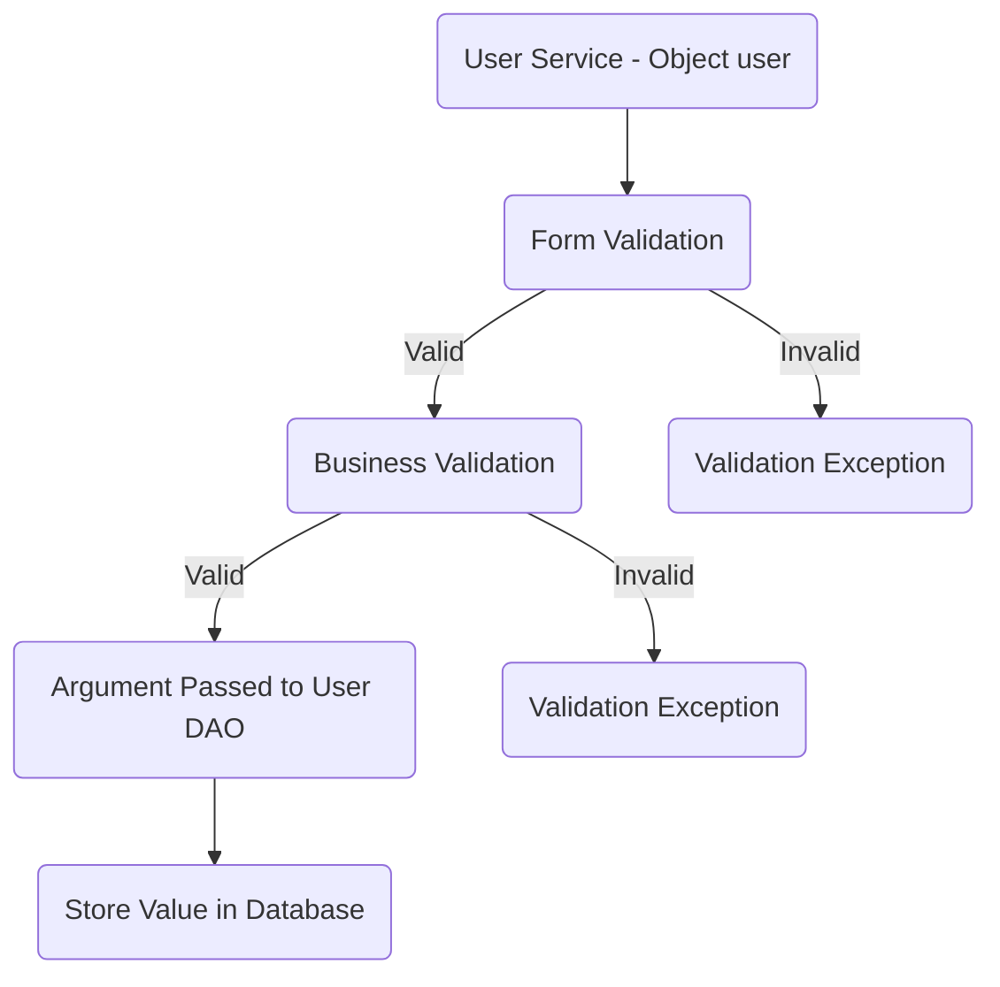
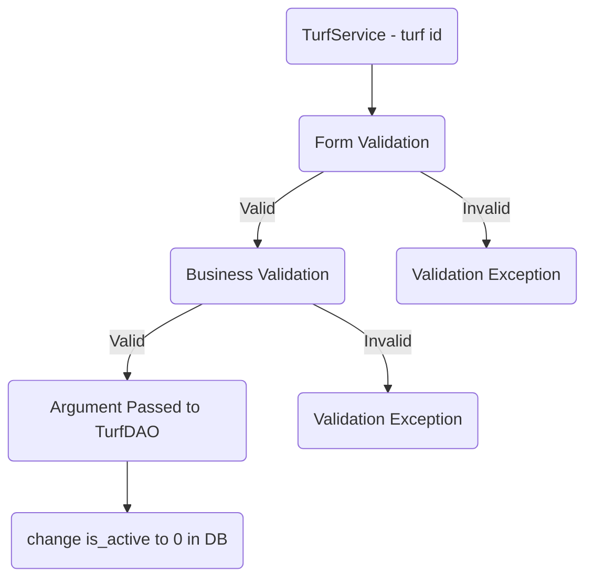

# Turf Application Checklist

## Database Design

- [ ] Create an ER diagram of the database
- [ ] Write Create table scripts [script](src/main/resources/db/migration/V1__create_users.sql)


## Project Setup

- [ ] Create a new Java project
- [ ] Set up a MySQL database
- [ ] Add necessary libraries
	- [ ] JDBC, 
	- [ ] MySQL Connector, 
	- [ ] JUnit, 
	- [ ] Dotenv

## Module: User 
### Feature: create user 
#### Pre-requisites:
- [ ] Create User table
- [ ] User model
- [ ] User DAO (create)
- [ ] User SERVICE (create)

#### Form Validations:
- [ ] Form Validation
	* User null
- [ ] id(<0)
- [ ] area( null, empty, pattern )
- [ ] city( null, empty, pattern )
- [ ] email( null, empty, pattern )
- [ ] password( null, empty, pattern )
- [ ] first name( null, empty, pattern )
- [ ] last name( null, empty, pattern )
- [ ] address(null, empty, pattern)

#### Business Validation:
- user email Already exists

### Messages :
* User object can not be null.  
* id can not be .   
* name cannot be null or empty.
* Name does not match the pattern.  
* Area does not match the pattern.  
*  Area can not be null or empty.
* City can not be null or empty.  
* city does not match with the pattern
* first name cannot be null or empty.
* First Name does not match the pattern.  
* last name cannot be null or empty.
* Last Name does not match the pattern.  
* Address can not be null or empty.  
* User already exists 

### Flow:  


### Feature 2 : Update user
 User story :  

User details successfully updated and stored in database.

### Pre-requisites:- 

- [ ]  completed feature 1 - update user
- [ ] User model
- [ ] User DAO (update)
- [ ] User SERVICE (update)

#### Form Validations:
- [ ] id(<0)
- [ ] password( null, empty, pattern )
- [ ] first name( null, empty, pattern )
- [ ] last name( null, empty, pattern )
 - [ ] area( null, empty, pattern )
- [ ] city( null, empty, pattern )
- [ ] address(null, empty, pattern)
#### Business Validation:
- user id exists 
### Messages :
* User object can not be null.  
* id can not be .   
* name cannot be null or empty.
* Name does not match the pattern.  
* first name cannot be null or empty.
* First Name does not match the pattern.  
* last name cannot be null or empty.
* Last Name does not match the pattern.  
* Address can not be null or empty.  
* Area does not match the pattern.  
*  Area can not be null or empty.
* City can not be null or empty.  
* city does not match with the pattern


### Feature 3 : Delete

### Pre-requisites:- 

- [ ]  completed feature 1 - delete user
- [ ] User model
- [ ] User DAO (delete)
- [ ] User SERVICE (delete)

#### Form Validations:
* id (< 0) 
#### Business Validations:
- user id exists 


## Module: Turf 
### Feature: create turf 
#### Pre-requisites:
- [ ] Create Turf table
- [ ] Turf model
- [ ] Turf DAO (create)
- [ ] Turf SERVICE (create)

#### Form Validations:
- [ ] Form Validation
- [ ]  Turf null
- [ ] email( null, empty, pattern )
- [ ] password( null, empty, pattern )
- [ ] owner name( null, empty, pattern )
- [ ]  image (null, empty) // cant validate correct url.
- [ ] address( null, empty, pattern )
- [ ] area( null, empty, pattern )
- [ ] city( null, empty, pattern )
- [ ] name( null, empty, pattern )
- [ ] opening hours ( null, empty, pattern ) local date time
- [ ] closing hours ( null, empty, pattern ) local date time

#### Business Validation:
- turf owner email Already exists

### Messages :
* Turf object can not be null.  
* id can not be .  
* Address can not be null or empty.  
* Area does not match the pattern.  
*  Area can not be null or empty.
* City can not be null or empty.  
* city does not match with the pattern
* name cannot be null or empty.
* Name does not match the pattern.  
* Opening hours can not null or empty.  
* opening hours does not match with the pattern
* Closing hours can not null or empty.  
* Closing hours does not match with the pattern
* Turf already exists 

### Flow:  


### Feature 2 : Update turf
User story :  
>Turf details successfully updated and stored in database.

### Pre-requisites:- 

- [ ]  completed feature 1 - update turf
- [ ] Turf model
- [ ] Turf DAO (update)
- [ ] Turf SERVICE (update)

#### Form Validations:
- [ ] id(<0)  
- [ ] password( null, empty, pattern )
- [ ] owner name( null, empty, pattern )
- [ ]  image (null, empty) // cant validate correct url.
- [ ] address( null, empty, pattern )
- [ ] area( null, empty, pattern )
- [ ] city( null, empty, pattern )
- [ ] name( null, empty, pattern )
- [ ] opening hours ( null, empty, pattern ) local date time
- [ ] closing hours ( null, empty, pattern ) local date time
#### Business Validation:
- turf id exists 
### Messages :
* Turf object can not be null.  
* id (<0)  .  
* Address can not be null or empty.  
* Area does not match the pattern.  
* Area can not be null or empty.  
* City can not be null or empty.  
* city does not match with the pattern
* name cannot be null or empty.
* Name does not match the pattern.  
* Opening hours can not null or empty.  
* opening hours does not match with the pattern
* Closing hours can not null or empty.  
* Closing hours does not match with the pattern


### Feature 3 : Delete

### Pre-requisites:- 

- [ ]  completed feature 1 - delete turf
- [ ] Turf model
- [ ] Turf DAO (delete)
- [ ] Turf SERVICE (delete)

#### Form Validations:
* id (< 0) 
#### Business Validations:
- turf id exists 


### Feature 2. View all Turf list

#### Pre-requisites :
- [ ] Turf module feature 1 should complete
- [ ] Implement Turf(find all)
- [ ] Implement Turf DAO (find all)

#### Validations : 

#### Flow :
```mermaid 
graph TD;
A[turf service- find all] --> E[Turf DAO: find all]
E --> H[Turf Service : list of turf]
   ```
### Feature 2. View all Turf list by Area

#### Pre-requisites :
- [ ] Turf module feature 1 should complete
- [ ] Implement Turf(find all)
- [ ] Implement Turf DAO (find all)

#### Validations : 
- [ ] area ( null, empty, pattern )

#### Business Validations:
- turf area exists 

``` mermaid  
graph TD;A(Turf Service- area ) --> B(Form Validation) -- Valid --> C(Business Validation)  
B -- Invalid --> H(Validation Exception)  
C -- Valid --> D(Argument Passed to Turf DAO)  
D --> F(get turf list by area from DB)
C -- Invalid --> E(Validation Exception) 
   ```
### Feature 2. View all Turf list by City

#### Pre-requisites :
- [ ] Turf module feature 1 should complete
- [ ] Implement Turf(find all)
- [ ] Implement Turf DAO (find all)

#### Validations : 
- [ ] city ( null, empty, pattern )

#### Business Validations:
- turf city exists 

``` mermaid  
graph TD;A(Turf Service- city) --> B(Form Validation) -- Valid --> C(Business Validation)  
B -- Invalid --> H(Validation Exception)  
C -- Valid --> D(Argument Passed to Turf DAO)  
D --> F(get turf list by city from DB)
C -- Invalid --> E(Validation Exception) 
   ```
